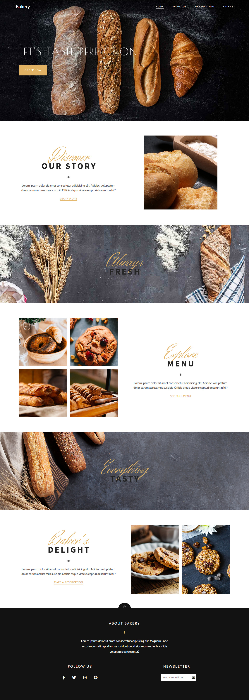

# Bakery
 
 

Bakery is a stylish and responsive bakery template, designed with an emphasis on mobile devices.

The project was created using HTML, CSS and JavaScript.

To animate elements when scrolling, the Scroll Reveal library is used, adding the effect of smooth content appearance.

All images are taken from open photo stocks.

The template contains three pages:

1. Home – introduces visitors to the range of baked goods.

2. About us – brief information about the bakery and its history.

3. Team – a gallery of masters who create delicious baked goods.

